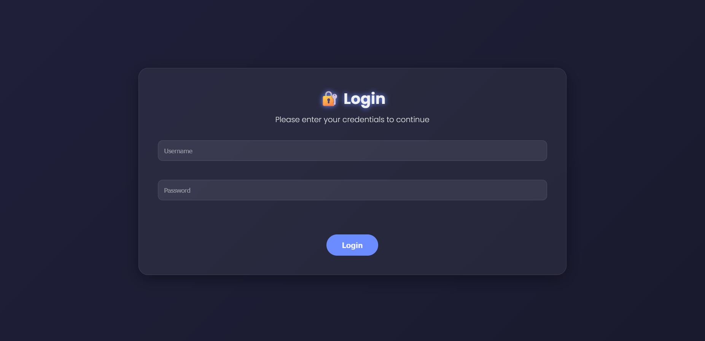
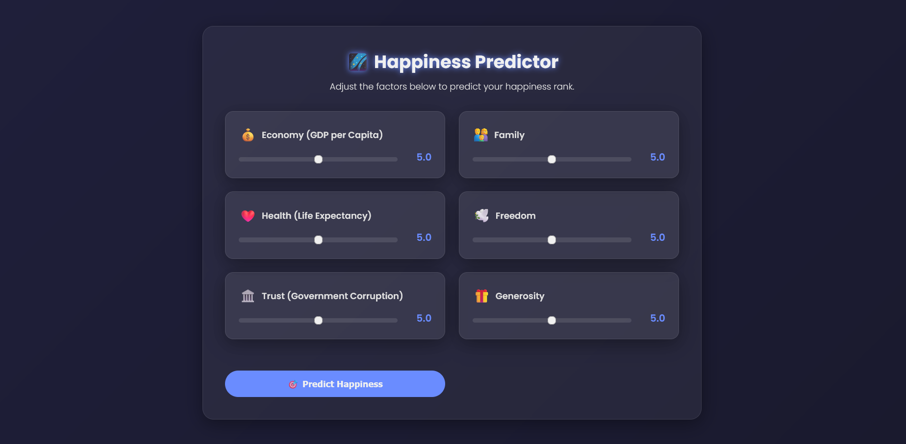
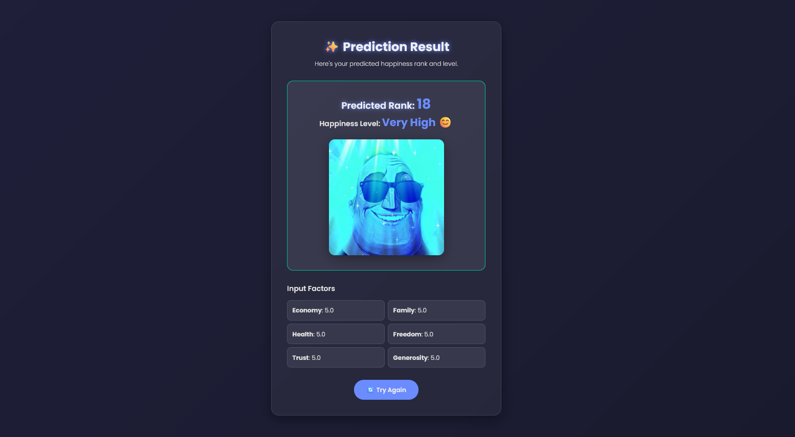

# 😃 World Happiness Rank Predictor [🌍 Live Demo](https://huggingface.co/spaces/GokulV/Happiness-prediction-Gradio)

> **Note:** To access the web app, use the following credentials:
>
> - **Username:** `gokul`
> - **Password:** `bitsathy`
This project is a **Machine Learning Web App** built with **Gradio +
Flask (multi-page frontend)** that predicts a country's **World
Happiness Rank** based on socio-economic factors.

------------------------------------------------------------------------

## 🚀 Features

-   🔑 **Login Authentication** (username: `gokul`, password:
    `bitsathy`)
-   🎨 **Stunning Frontend UI** with custom HTML, CSS & JavaScript
-   📊 Interactive **sliders for input factors**
-   🎯 **Predicted Rank & Happiness Level** displayed on a separate
    results page
-   🎵 **Sound Effects** triggered based on prediction result (happy /
    neutral / sad tones)
-   📈 Bar chart visualization of factor contributions

------------------------------------------------------------------------

## 📂 Project Structure

    project/
    │── app.py                 # Main Python backend (Flask + Gradio integration)
    │── happiness-model.pkl     # Pre-trained Random Forest model
    │── templates/              # HTML templates (login, input, predicted pages)
    │   │── login.html
    │   │── input.html
    │   │── predicted.html
    │── static/                 # Static files (CSS, JS, Images, Sounds)
    │   │── style.css
    │   │── script.js
    │   │── success.mp3
    │   │── sad.mp3
    │── README.md               # Project documentation
    │── requirements.txt        # Python dependencies

------------------------------------------------------------------------

## ⚙️ Setup Instructions

1.  Clone this repository:

    ``` bash
    git clone https://github.com/Gokul-bit165/Happiness-prediction-Gradio.git
    cd happiness-rank-predictor
    ```

2.  Install dependencies:

    ``` bash
    pip install -r requirements.txt
    ```

3.  Run the app:

    ``` bash
    python app.py
    ```

4.  Open in browser:

        http://127.0.0.1:5000

------------------------------------------------------------------------

## 🖼️ Screenshots

### 🔐 Login Page



### ⚙️ Input Factors Page



### 📊 Prediction Result Page



------------------------------------------------------------------------

## 🌍 Live Demo

👉 [Try the Live App](https://huggingface.co/spaces/GokulV/Happiness-prediction-Gradio)

------------------------------------------------------------------------

## 📌 Tech Stack

-   **Python** (Flask, Gradio, Pandas, Joblib)
-   **Frontend**: HTML, CSS, JavaScript
-   **ML Model**: Random Forest (trained on World Happiness dataset)
-   **Visualization**: Gradio BarPlot + custom UI elements

------------------------------------------------------------------------

## 🎯 Future Improvements

-   ✅ Add user registration system
-   ✅ Deploy to cloud (Heroku / Render / Hugging Face Spaces)
-   ✅ Add more interactive animations & sounds
-   ✅ Extend dataset with real-time happiness reports

------------------------------------------------------------------------

## 👨‍💻 Author

**Gokul V**\
💡 Built for learning and hackathon experimentation 🚀
